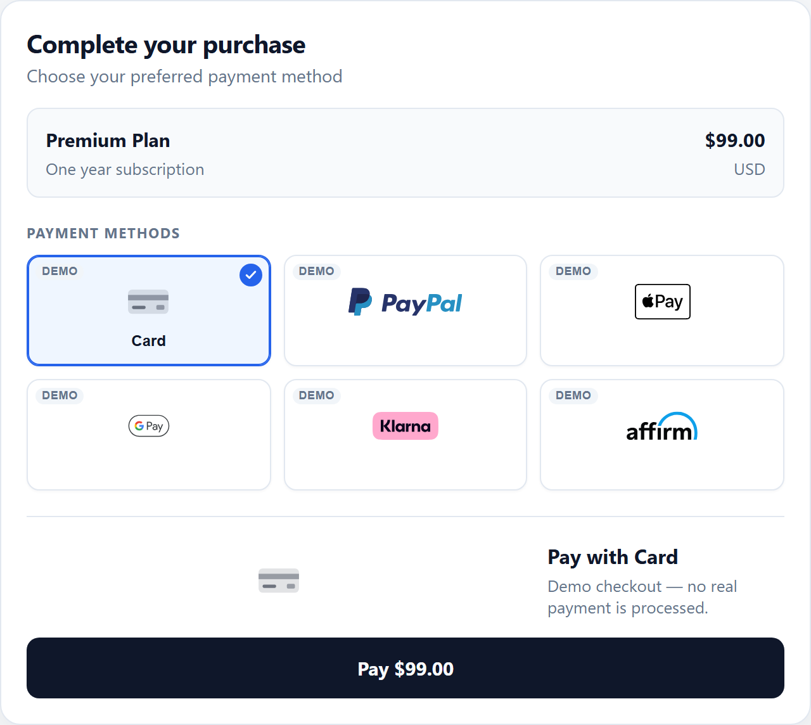
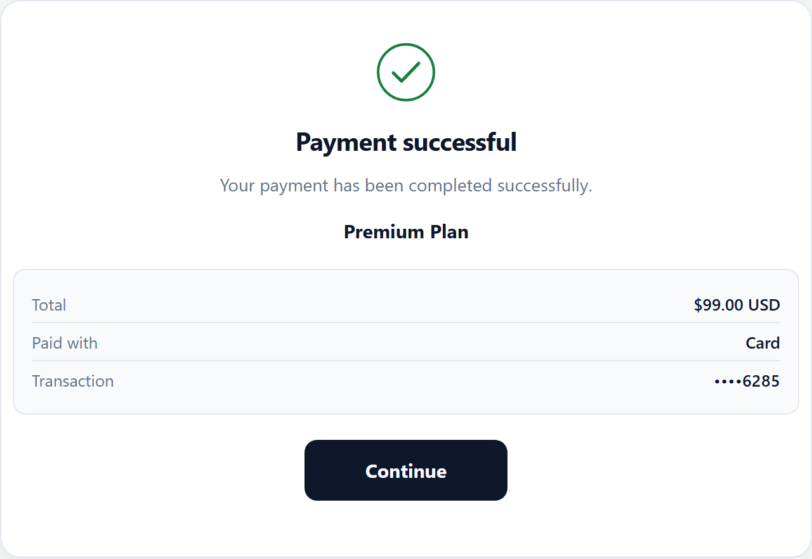
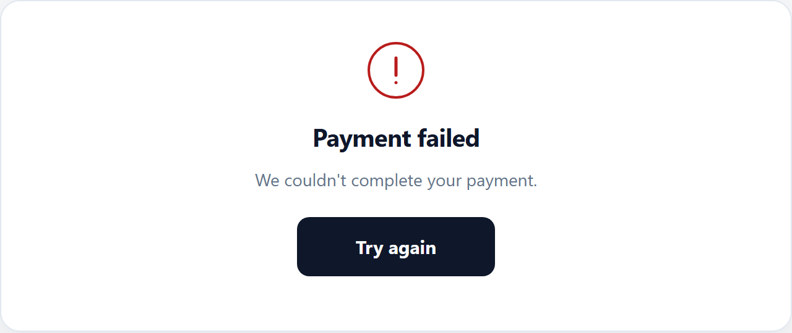
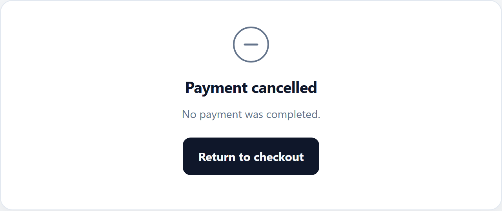

# Payment Flow

What customers see when paying with Easy Payments — from method selection through the final outcome.

Easy Payments normalizes provider-specific journeys into one consistent checkout experience and a small set of customer-facing screens.

---

## Customer journey

```text
Checkout (method selection)
        │
        ▼
Provider interaction
  (card fields, PayPal, wallet sheet, Klarna/Affirm redirect, …)
        │
        ▼
Processing
        │
        ├──► Success confirmation   (default)
        ├──► Error
        └──► Cancelled
```

Alternate paths:

```text
Processing ──► Error
Provider flow ──► Cancelled
```

---

## Customer-facing states

| Experience | What the customer sees |
|------------|------------------------|
| **Checkout** | Product summary + payment method list (configured order; unavailable methods omitted). |
| **Provider interaction** | Method-specific UI (Stripe Elements, PayPal buttons, wallet sheets, BNPL redirect). Method switching is locked while a flow is active. |
| **Processing** | Full-checkout outcome: spinner, “Processing payment…”, “Please don't close this window.” |
| **Success** | Confirmation (when `successBehavior` is `confirmation`): product, total, paid-with method, truncated transaction ref, **Continue**. |
| **Error** | Failure screen + safe message + **Try again**. |
| **Cancelled** | Cancelled screen + **Return to checkout**. |

<p align="center">
  
</p>

### Processing

<p align="center">
  
</p>

### Success

<p align="center">
  
</p>

### Error

<p align="center">
  
</p>

### Cancelled

<p align="center">
  
</p>

---

## Provider differences (same final UX)

| Method | Typical interaction | Then |
|--------|---------------------|------|
| **Card** | Stripe Payment Element fields | Processing → success / error / cancel |
| **PayPal** | PayPal buttons + create/capture | Processing → success / error / cancel |
| **Apple Pay** | Official Stripe Express Checkout Apple Pay button | Processing → success / error / cancel |
| **Google Pay** | Google Pay button / sheet | Processing → success / error / cancel |
| **Klarna** | Stripe Klarna flow (often redirect) + return recovery | Processing → success / error / cancel |
| **Affirm** | Stripe Affirm flow (often redirect) + return recovery | Processing → success / error / cancel |

Providers differ mid-flow; Easy Payments still ends on the same processing / success / error / cancelled screens and the same public events.

---

## `successBehavior`

| Value | UI after a successful payment |
|-------|-------------------------------|
| `confirmation` (default) | Built-in success screen; emit `(success)`, then `(successContinue)` when the customer clicks **Continue**. |
| `event-only` | Emit `(success)` only; stay on / return to checkout UI so the host app owns post-payment UX. |

Also settable via `[checkout]="{ successBehavior: 'event-only' }"`.

---

## Events in the flow

| Event | When |
|-------|------|
| `(success)` | Payment completed successfully. |
| `(cancel)` | Customer cancelled (or equivalent cancel path). |
| `(error)` | Payment or configuration failure. |
| `(successContinue)` | Customer clicked **Continue** on the built-in success screen (confirmation mode). Resets the checkout UI for another attempt without a full page reload. |

### About busy / processing signals

`<easy-payments>` does **not** expose a public `(busyChange)` output.

While a provider flow is active, Easy Payments locks method switching and may show the processing outcome screen. Child method panels use internal busy signals; consumers should rely on the visible UI and the public events above.

---

## Redirects & return recovery

Klarna and Affirm (Stripe-backed) may leave the page and return with Stripe query parameters. Easy Payments detects the return, shows **Processing**, then resolves to success / error / cancel and emits the matching event.

`successUrl` / `cancelUrl` on `checkout` are merchant hints only — Easy Payments does **not** auto-redirect on them.

---

## Related

- [API reference](./api.md)
- [Configuration](./configuration.md)
- [Security](./security.md)
